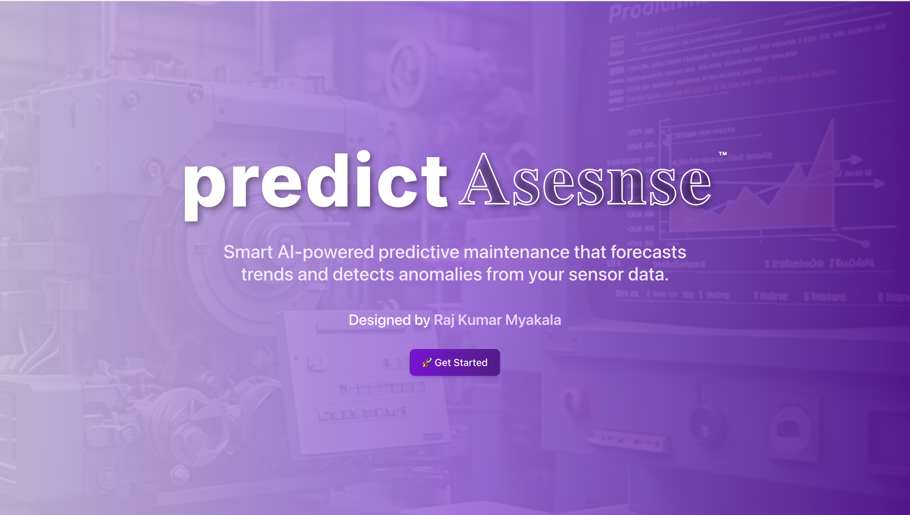
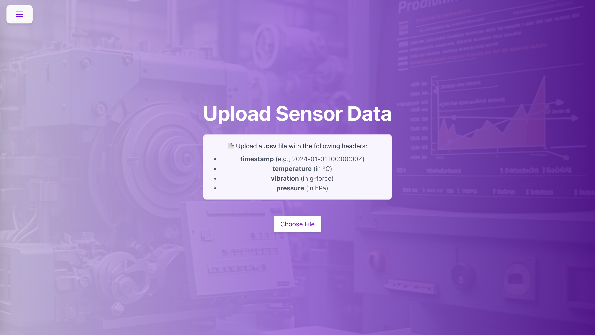
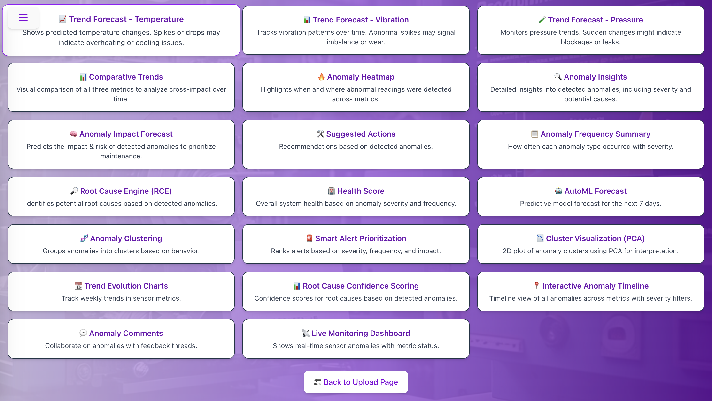

# 🧠 PredictAsense

**PredictAsense** is an AI-powered predictive maintenance platform tailored for **industrial IoT**. It helps engineers and analysts **detect anomalies**, **visualize sensor trends**, and **receive real-time alerts** to prevent costly equipment failures.

> 🎯 Built for smart factories, manufacturing plants, and industrial automation.

---

## 📸 Preview

### Landing Page


### Upload Page


### 📍 Forecast Dashboard



---

## 🚀 Features

- ✅ Upload CSV sensor data via interactive dashboard  
- 🔍 AI-based anomaly detection using Prophet & Isolation Forest  
- 📊 Interactive charts: trends, clusters, impact, and root cause analysis  
- 🔔 Real-time alerts via **Slack** & **Email**  
- 📆 Anomaly timeline, heatmap, and AutoML forecast  
- 💬 Team collaboration through comments & journaling  
- 🧠 Smart alert prioritization and confidence scoring

---

## 🛠️ Tech Stack

### ⚙️ Frontend
- React + TypeScript + TailwindCSS
- Nivo Charts, Vis Timeline
- Firebase Hosting & Firestore

### 🔄 Backend
- Python, FastAPI (for AutoML Forecasting API)
- Prophet, Scikit-learn (Isolation Forest)
- Pandas, NumPy, Matplotlib

### 📡 Integrations
- Slack Webhooks for anomaly alerts
- SMTP for email notifications

---

## 📁 Folder Structure

```bash
predictasense/
│
├── frontend/         # React app with all UI, charts, routing
├── backend/          # FastAPI for ML prediction API
├── notebooks/        # Jupyter analysis and experiments
├── public/           # Hosting static files
├── .env              # Slack + Firebase config (ignored)
└── firebase.json     # Firebase deployment config
```

---

## 📅 Development Timeline

| Date        | Milestone                              |
|-------------|------------------------------------------|
| **Feb 2025** | Idea inception, project scaffold         |
| **Mar 2025** | MVP: Heatmap + Anomaly Detection         |
| **Apr 2025** | AutoML forecast + PDF reports            |
| **May 2025** | Slack alerts, team comments, clustering  |
| **Apr 2025** | Firebase deploy + Firestore sync         |

---

## 🔍 How It Works

1. Upload time-series sensor data (.csv)
2. Data is processed → anomalies detected (Temp > 80, Vibration > 0.07, Pressure > 1015)
3. Results shown in:
   - 📈 Line & Comparative charts
   - 🔥 Heatmap
   - 🧬 Cluster visualization (PCA)
   - 📊 Alert Prioritization Table
4. Real-time alerts sent to Slack/email
5. Insights & actions recommended
6. Synced live with Firestore

---

## 🤝 Real-World Use Cases

- 🏭 Industrial Machinery Health Monitoring  
- ⚙️ Preventive Maintenance Scheduling  
- 📉 Downtime Risk Forecasting  
- 👷 Team Collaboration & Anomaly Journaling  

---

## 💡 Future Enhancements

- 📱 Mobile responsive dashboard  
- 📡 Real-time data streaming with MQTT/WebSockets  
- 📦 Dockerize full stack  
- 🔐 Role-based access + analytics history  
- 📊 Power BI or Grafana integration

---

## 🌐 Hosting

🔗 **Live Project**: [https://predictasense.web.app](https://predictasense.web.app)

---

## 👨‍💻 Author

**Raj Kumar Myakala**  
[GitHub](https://github.com/rajkumar160798) • [LinkedIn](https://www.linkedin.com/in/raj-kumar-myakala-927860264/) • [Medium](https://medium.com/@myakalarajkumar1998)

---

## 📄 License

This project is licensed under the [MIT License](LICENSE).
